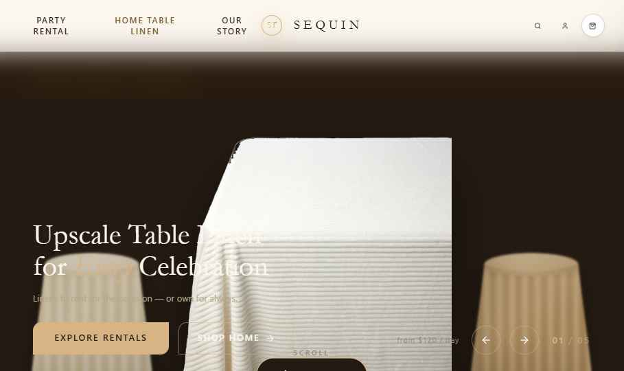
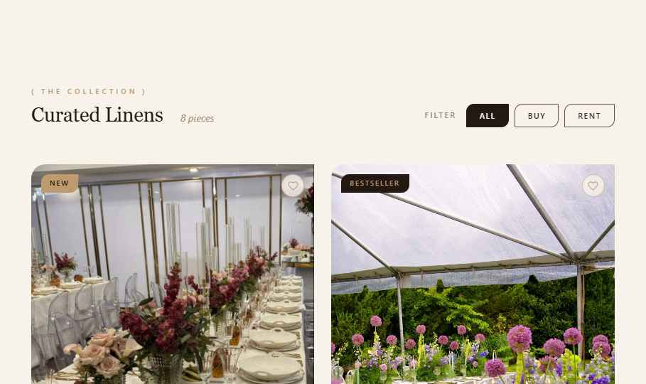

# Sequin Table

Design system and interactive storefront concept for a premium table-linen brand.



## The brief

Translate a high-touch event-linen brand into a digital storefront that feels editorial, tactile, and premium while keeping rental and home-linen paths immediately understandable.

## The result

The concept combines a reusable design system with a responsive React storefront. Visitors can move between rental and home collections, explore products, and interact with a polished catalog and cart experience.



## Design direction

- Warm linen, espresso, champagne-gold, bordeaux, and sage color system
- Geometric display type paired with an editorial serif
- Product-led photography with restrained metallic and glass effects
- Reusable tokens for color, type, spacing, radius, elevation, and motion
- Responsive storefront patterns with reduced-motion support

## Product experience

- Rental and home-linen entry points
- Filterable product catalog
- Product cards, collection storytelling, and process content
- Interactive cart drawer
- Responsive navigation and footer
- Reusable component specimens and storefront layouts

## Architecture

The primary concept is a Vite, React, and TypeScript application in `src/`. The repository also includes the underlying design-system tokens, component specimens, and standalone storefront references used to develop the visual language.

Detailed design-system rationale and implementation guidance live in [`docs/DESIGN_SYSTEM.md`](docs/DESIGN_SYSTEM.md).

## Local preview

```bash
npm install
npm run dev
```

For a production check:

```bash
npm run build
npm run preview
```

## My role

I developed the product direction, visual system, component language, interactive storefront concept, and frontend implementation.

## Repository note

This is a portfolio case study and project source. No open-source license is granted by this repository.
